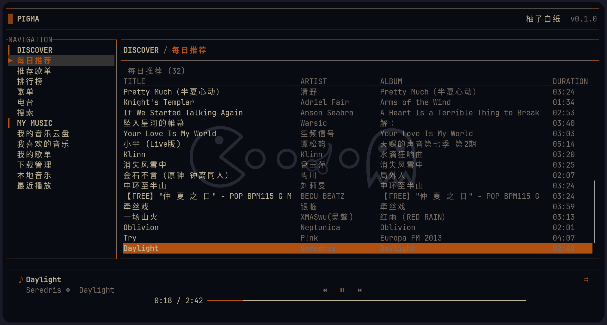
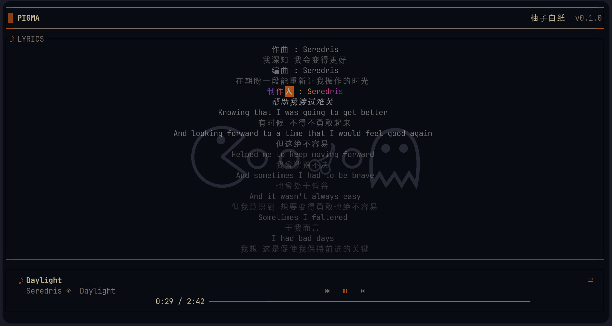
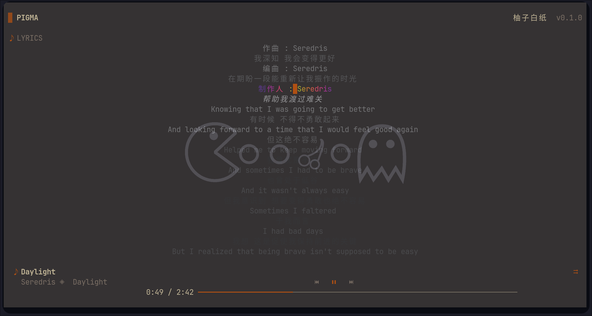
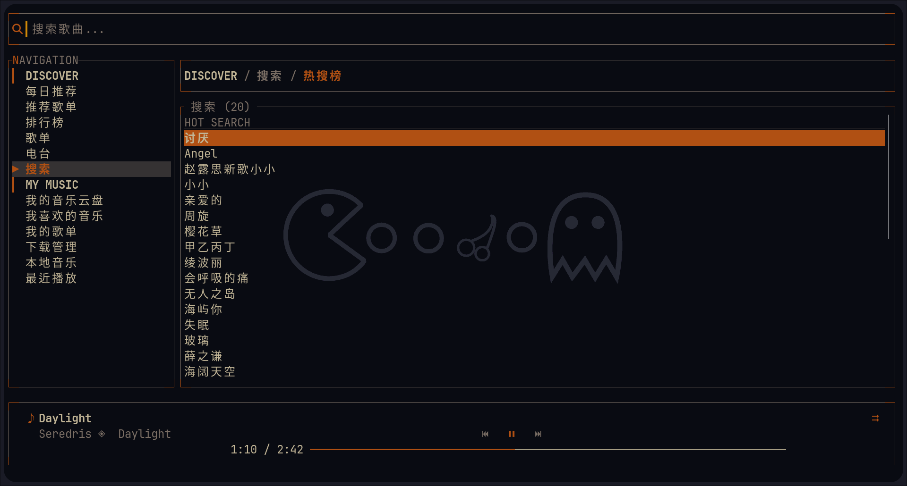

# pigma (In development)

[](https://github.com/akirco/pigma/actions/workflows/ci.yml)
[](https://github.com/akirco/pigma/actions/workflows/release.yml)
[](LICENSE)

A NetEase Cloud Music (网易云音乐) or local audio playback TUI client built with [Ratatui](https://ratatui.rs).

## Features

- [x] 流式播放，边听边存
- [x] 低延迟seek
- [x] 本地音频播放
- [x] 自定义渲染列表
- [x] 自定义渲染列
- [x] 歌词渐变逐字高亮
- [x] table标题自定义
- [ ] 本地音频歌词，元数据重写
- [ ] 下载管理（重合边听边存）
- [ ] 最近播放上报
- [ ] 心动模式
- [ ] 云盘源作为fallback
- [ ] 云盘上传
- [ ] 数据分页加载
- [ ] 歌手信息
- [ ] 更多layout支持
- [ ] 重写playerbar(支持歌曲封面)
- [ ] table标题自定位置
- [ ] ascii art style 歌词
- [ ] 支持系统包管理器安装

## Preview


<table>
  <tr>
    <td></td>
    <td></td>
  </tr>
  <tr>
    <td></td>
    <td></td>
  </tr>
</table>


## Install

> Note: the `gnu` Linux builds depend on system audio libraries (e.g. `alsa-lib`). The `musl` builds are fully static and portable across distributions.

### From releases


```sh
# https://github.com/marcosnils/bin
bin install https://github.com/akirco/pigma
```

`windows(scoop)`

```
scoop bucket add aki 'https://github.com/akirco/aki-apps.git'
scoop install aki/pigma
```

### From source (cargo)

```sh
cargo install --git https://github.com/akirco/pigma.git
```

### Build from source

```sh
git clone https://github.com/akirco/pigma.git
cd pigma
cargo build --release
# binary at target/release/pigma
```

## Usage


| 快捷键              |                   描述                   |
| :------------------ | :--------------------------------------: |
| tab/shift+tab       |              切换导航                    |
| enter               |              播放/进入列表               |
| space               |                   暂停                   |
| f                   |                 播放队列                 |
| l                   |                   歌词                   |
| /                   |                搜索/过滤                 |
| b                   |                 样式切换                 |
| left /right         |                 seek 15s                 |
| shift + left /right |              上一首/下一首               |
| ctrl+p              |              command panel               |
| p                   |          切换表格为cell/row模式          |
| m                   | 切换播放模式（心动模式存在问题，需重写） |


## Configuration

Config file location: `~/.config/pigma/config.toml`

### Columns Configuration

Each content type has two levels of columns: **type-defaults** and **per-API overrides**.

下面两种写法在 TOML 中等价，**手写时均可使用**：

**写法一：内联数组（紧凑）**

```toml
[columns]
songs = [
    { header = "TITLE", field = "name", min_width = 18 },
    { header = "ARTIST", field = "singer", width = 16 },
    { header = "ALBUM", field = "album", min_width = 12 },
    { header = "DURATION", field = "duration", width = 9 },
]
songlist = [
    { header = "NAME", field = "name", min_width = 20 },
    { header = "AUTHOR", field = "author", width = 16 },
]

[columns.overrides]
toplist = [
    { header = "NAME", field = "name", width = 20 },
    { header = "DESCRIPTION", field = "description", min_width = 20 },
]
search = [
    { header = "HOT SEARCH", field = "keyword", min_width = 1 },
]
```

**写法二：数组-of-tables（程序保存时采用此格式）**

```toml
[[columns.songs]]
header = "TITLE"
field = "name"
min_width = 18

[[columns.songs]]
header = "ARTIST"
field = "singer"
width = 16

[[columns.songs]]
header = "ALBUM"
field = "album"
min_width = 12

[[columns.songs]]
header = "DURATION"
field = "duration"
width = 9

[[columns.songlist]]
header = "NAME"
field = "name"
min_width = 20

[[columns.songlist]]
header = "AUTHOR"
field = "author"
width = 16

[[columns.overrides.toplist]]
header = "NAME"
field = "name"
width = 20

[[columns.overrides.toplist]]
header = "DESCRIPTION"
field = "description"
min_width = 20

[[columns.overrides.search]]
header = "HOT SEARCH"
field = "keyword"
min_width = 1
```

两种写法均可被程序正确读取；`save()` 时统一以「写法二」写回磁盘。

#### Column width types

| Format           | Description               |
| ---------------- | ------------------------- |
| `width = 16`     | Fixed width in characters |
| `min_width = 18` | Minimum width, flex grows |
| `ratio = [1, 3]` | Proportional ratio weight |

#### Available fields by content type

**`songs`** (SongInfo) — used by these APIs:

| API               | Description         |
| ----------------- | ------------------- |
| `recommend_songs` | 每日推荐            |
| `user_cloud_disk` | 我的音乐云盘        |
| `recent_songs`    | 最近播放            |
| `liked_songs`     | 我喜欢的音乐        |
| `local_music`     | 本地音乐            |
| Playlist entry    | 歌单/排行榜内的歌曲 |

Fields:

| field      | Type   | Notes                            |
| ---------- | ------ | -------------------------------- |
| `name`     | String | 歌曲名                           |
| `singer`   | String | 歌手                             |
| `album`    | String | 专辑                             |
| `duration` | String | 时长，已格式化为 `MM:SS`（自动） |

**`songlist`** (SongList) — used by these APIs:

| API                  | Description |
| -------------------- | ----------- |
| `recommend_resource` | 推荐歌单    |
| `top_song_list`      | 歌单        |
| `user_radio_sublist` | 电台        |
| `user_song_list`     | 我的歌单    |

Fields:

| field    | Type   | Notes  |
| -------- | ------ | ------ |
| `name`   | String | 歌单名 |
| `author` | String | 作者   |

**`toplist` (override)** (TopList):

| API       | Description |
| --------- | ----------- |
| `toplist` | 排行榜      |

Fields:

| field         | Type   | Notes  |
| ------------- | ------ | ------ |
| `name`        | String | 榜单名 |
| `description` | String | 描述   |

**`singers`** (SingerInfo) — used by these APIs:

| API           | Description |
| ------------- | ----------- |
| `top_singers` | 热门歌手    |

Fields:

| field  | Type   | Notes   |
| ------ | ------ | ------- |
| `name` | String | 歌手名  |
| `id`   | u64    | 歌手 ID |

**`search` (override)** (HotSearch):

| API      | Description |
| -------- | ----------- |
| `search` | 搜索-热搜榜 |

Fields:

| field     | Type   | Notes      |
| --------- | ------ | ---------- |
| `keyword` | String | 搜索关键词 |

#### All override keys

Any API endpoint can have a `[columns.overrides.{key}]` entry. Available keys:

| Key                  | Default type | Description        |
| -------------------- | ------------ | ------------------ |
| `recommend_songs`    | songs        | 每日推荐           |
| `recommend_resource` | songlist     | 推荐歌单           |
| `toplist`            | toplist      | 排行榜             |
| `top_song_list`      | songlist     | 歌单               |
| `user_radio_sublist` | songlist     | 电台               |
| `user_cloud_disk`    | songs        | 我的音乐云盘       |
| `__liked__`          | songs        | 我喜欢的音乐       |
| `user_song_list`     | songlist     | 我的歌单           |
| `__local_music__`    | songs        | 本地音乐           |
| `__recent__`         | songs        | 最近播放           |
| `top_singers`        | singers      | 热门歌手           |
| `search`             | songs        | 搜索-热搜榜        |
| `__download__`       | —            | 下载管理（未实现） |

### Title templates

```toml
[titles]
sidebar = "NAVIGATION"
playlist = "\u266a QUEUE ({count})"  # {count} = song count
lyrics = "\u266a LYRICS"
```

`{name}` and `{count}` placeholders are supported in the NavItem title template.

### Progress bar customization

```toml
[playerbar]
filled_symbol = "━"
unfilled_symbol = "─"
filled_color = "accent"                        # theme field name for progress
unfilled_color = "muted"                       # theme field name for track (uncached)
unfilled_color_cached = "highlight"            # theme field name for track (cached)
```

Supported theme color names: `bg`, `surface`, `text`, `accent`, `highlight`, `muted`, `error`, `warning`.

### Content cache

```toml
content_cache_ttl = 300  # seconds, 0 to disable
```

### Lyric gradient

歌词当前行高亮渐变风格（自实现，无额外依赖）：

```toml
lyric_gradient = "warm"  # warm | cubehelix | rainbow | spectral | viridis | turbo
```

未知值回退到 `warm`。

### Navigation items

Each nav item can have:

```toml
[[navigation.sections.items]]
name = "推荐歌单"
api = "recommend_resource"
title_template = "{name} ({count})"
```

#### Section titles support rich-text markup

The `title` of a `[[navigation.sections]]` entry supports inline markup tags that
are styled by the active theme:

| Tag                  | Meaning      |
| -------------------- | ------------ |
| `<accent>…</accent>` | Accent color |
| `<b>…</b>`           | Bold         |

Example (the default):

```toml
[[navigation.sections]]
title = "<accent>▎</accent> <b>DISCOVER</b>"

[[navigation.sections.items]]
name = "每日推荐"  # 同样支持title的标记语法
api = "recommend_songs"
title_template = "{name} ({count})"
```

### Theme

pigma no longer ships built-in themes. You must define one or more `[[themes]]`
entries in your config, and select the active one via `default_theme` (matched by
`name`). If `themes` is empty, the UI falls back to a built-in default palette.

```toml
default_theme = "rose-pine"

[[themes]]
name = "rose-pine"
bg = "#191724"
surface = "#26233A"
text = "#E0DEF4"
accent = "#EB6F92"
highlight = "#31748F"
muted = "#6E6A86"
error = "#EB6F92"
warning = "#F6C177"
```

Supported theme color fields: `bg`, `surface`, `text`, `accent`, `highlight`,
`muted`, `error`, `warning`.

You can define multiple themes and switch between them at runtime (style toggle,
default key `b`).

## Development

```sh
git clone https://github.com/akirco/pigma.git
cd pigma
cargo run
```


See [ARCHITECTURE.md](ARCHITECTURE.md) for the project structure.

## License

Licensed under the [AGPL-3.0](LICENSE) license.
