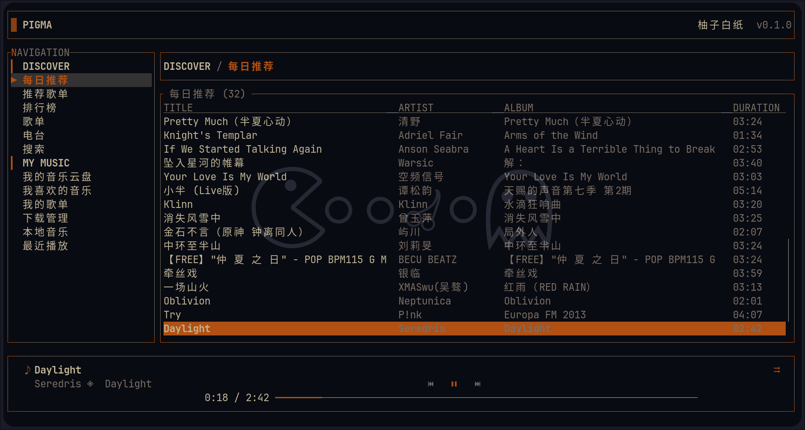
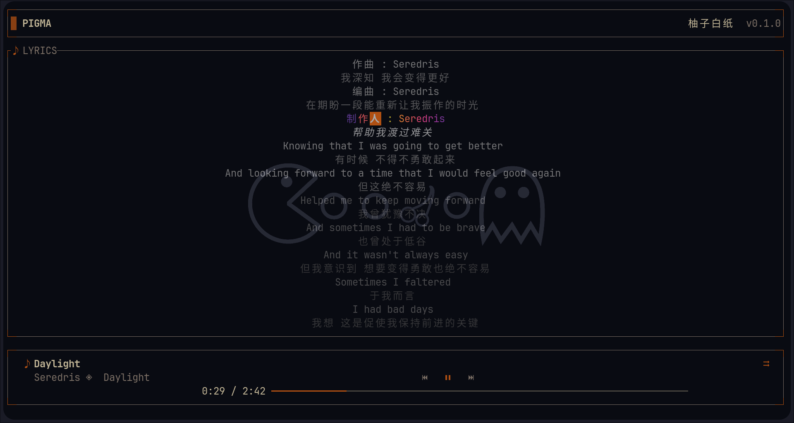
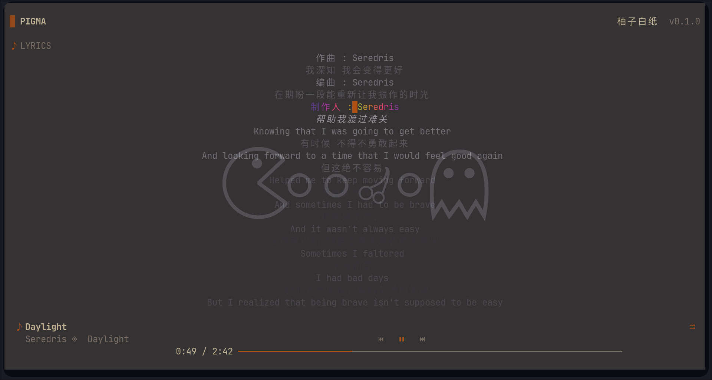
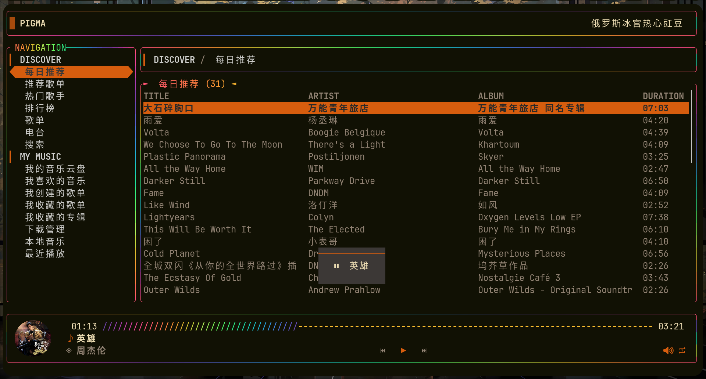

# pigma (In development)

[](https://github.com/akirco/pigma/actions/workflows/ci.yml)
[](https://github.com/akirco/pigma/actions/workflows/release.yml)
[](LICENSE)
[](https://aur.archlinux.org/packages/pigma-bin)


A NetEase Cloud Music (网易云音乐) or local audio playback TUI client built with [Ratatui](https://ratatui.rs).

<details>
<summary><b>📖 点击展开/折叠目录 (Table of Contents)</b></summary>

- [pigma (In development)](#pigma-in-development)
  - [Features](#features)
  - [Preview](#preview)
  - [Install](#install)
    - [From releases](#from-releases)
    - [From source (cargo)](#from-source-cargo)
    - [Build from source](#build-from-source)
  - [Usage](#usage)
  - [Configuration](#configuration)
    - [Columns Configuration](#columns-configuration)
      - [Column width types](#column-width-types)
      - [Available fields by content type](#available-fields-by-content-type)
      - [All override keys](#all-override-keys)
    - [Navigation layout](#navigation-layout)
    - [Title templates](#title-templates)
    - [Progress bar customization](#progress-bar-customization)
    - [Content cache](#content-cache)
    - [Lyric gradient](#lyric-gradient)
    - [Navigation items](#navigation-items)
      - [Section titles support rich-text markup](#section-titles-support-rich-text-markup)
    - [Theme](#theme)
  - [Development](#development)
  - [License](#license)

</details>


**注意：**

> 该项目仅供学习与研究使用.

**升级注意备份配置文件，当前自动备份迁移并没有写**

**[配置参考](./config.example.toml)**

**终端必须配置并使用支持 Nerd Fonts（如 JetBrainsMono Nerd Font, FiraCode Nerd Font 等）的字体，否则 `\uE0B2`等字符无法正确显示，会变成乱码或方块。**

## Features

- [x] 流式播放，边听边存
- [x] 低延迟seek
- [x] 本地音频播放
- [x] 自定义渲染导航列表
- [x] 自定义渲染内容列表
- [x] 歌词渐变逐字高亮
- [x] table标题自定义
- [x] 心动模式
- [x] 数据分页加载(目前仅支持云盘)
- [x] kugou,kuwo,bilibili,youtube源fallback(无需cookie),参考[UnblockNeteaseMusic](https://github.com/UnblockNeteaseMusic/server)
- [x] 歌曲操作(like,dislike,fav .etc)
- [x] 重构播放队列
- [x] 下载管理（重合边听边存）
- [x] 重写playerbar(支持歌曲封面)
- [x] 云盘上传（缓存文件，本地文件）
- [x] 音量控制
- [x] 更多layout支持
- [x] 支持系统包管理器安装(yay,paru,scoop)
- [x] 支持搜索多源
- [ ] 优化主题配色
- [ ] JSON IPC控制（waybar.etc）
- [ ] 重构播放队列添加逻辑
- [ ] 重写splash
- [ ] 修复手机验证码\邮箱登录
- [ ] styled_text标记语法嵌套
- [ ] command panel重写，更多运行时配置支持
- [ ] 云盘源作为fallback
- [ ] 本地音频歌词，元数据重写
- [ ] landing page
- [ ] 重构进入程序流程
- [ ] 歌手信息
- [ ] 行内简易模式
- [ ] ~~新增可选歌词页(沉浸式封面+歌词)~~
- [ ] ~~ascii art style 歌词~~

## Preview


<table>
  <tr>
    <td></td>
    <td></td>
  </tr>
  <tr>
    <td></td>
    <td></td>
  </tr>
</table>


## Install

> Note: the `gnu` Linux builds depend on system audio libraries (e.g. `alsa-lib`).

### From releases


```sh
# https://github.com/marcosnils/bin
bin install https://github.com/akirco/pigma
```

`windows(scoop)`

```sh
scoop bucket add aki 'https://github.com/akirco/aki-apps.git'
scoop install aki/pigma
```

`linux(aur)`
```sh
yay -S pigma

#or

paru -S pigma
```

### From source (cargo)

```sh
cargo install --git https://github.com/akirco/pigma.git
```

### Build from source

```sh
git clone https://github.com/akirco/pigma.git
cd pigma
cargo build --release
# binary at target/release/pigma
```

## Usage


| 快捷键        |                     描述                     |
| :------------ | :------------------------------------------: |
| ctrl+l        |                 清空播放队列                 |
| s/d           |       添加到喜欢/不感兴趣(仅每日推荐)        |
| tab/shift+tab |              切换导航/搜索引擎               |
| enter         |                播放/进入列表                 |
| space         |                     暂停                     |
| f             |                   播放队列                   |
| l             |                     歌词                     |
| /             |                  搜索/过滤                   |
| b             |                   样式切换                   |
| left /right   |                   seek 15s                   |
| p /n          |                上一首/下一首                 |
| ctrl+p        |                command panel                 |
| c             |  切换表格为cell/row模式(回车进入歌手/专辑)   |
| m             | 切换播放模式（适用于我的歌单或我喜欢的音乐） |
| u             |  上传`本地音乐`或`下载管理`的音频到音乐云盘  |
| g/G           |                列表顶部/底部                 |


## Configuration

Config file location: `~/.config/pigma/config.toml`

### Columns Configuration

Each content type has two levels of columns: **type-defaults** and **per-API overrides**.


```toml
[columns]
songs = [
    { header = "TITLE", field = "name", min_width = 18 },
    { header = "ARTIST", field = "singer", width = 16 },
    { header = "ALBUM", field = "album", min_width = 12 },
    { header = "DURATION", field = "duration", width = 9 },
]
songlist = [
    { header = "NAME", field = "name", min_width = 20 },
    { header = "AUTHOR", field = "author", width = 16 },
]

[columns.overrides]
toplist = [
    { header = "NAME", field = "name", width = 20 },
    { header = "DESCRIPTION", field = "description", min_width = 20 },
]
search = [
    { header = "HOT SEARCH", field = "keyword", min_width = 1 },
]
```


#### Column width types

| Format           | Description               |
| ---------------- | ------------------------- |
| `width = 16`     | Fixed width in characters |
| `min_width = 18` | Minimum width, flex grows |
| `ratio = [1, 3]` | Proportional ratio weight |

#### Available fields by content type

**`songs`** (SongInfo) — used by these APIs:

| API               | Description         |
| ----------------- | ------------------- |
| `recommend_songs` | 每日推荐            |
| `user_cloud_disk` | 我的音乐云盘        |
| `recent_songs`    | 最近播放            |
| `liked_songs`     | 我喜欢的音乐        |
| `local_music`     | 本地音乐            |
| Playlist entry    | 歌单/排行榜内的歌曲 |

Fields:

| field      | Type   | Notes                            |
| ---------- | ------ | -------------------------------- |
| `name`     | String | 歌曲名                           |
| `singer`   | String | 歌手                             |
| `album`    | String | 专辑                             |
| `duration` | String | 时长，已格式化为 `MM:SS`（自动） |

**`songlist`** (SongList) — used by these APIs:

| API                  | Description |
| -------------------- | ----------- |
| `recommend_resource` | 推荐歌单    |
| `top_song_list`      | 歌单        |
| `user_radio_sublist` | 电台        |
| `user_song_list`     | 我的歌单    |

Fields:

| field    | Type   | Notes  |
| -------- | ------ | ------ |
| `name`   | String | 歌单名 |
| `author` | String | 作者   |

**`toplist` (override)** (TopList):

| API       | Description |
| --------- | ----------- |
| `toplist` | 排行榜      |

Fields:

| field         | Type   | Notes  |
| ------------- | ------ | ------ |
| `name`        | String | 榜单名 |
| `description` | String | 描述   |

**`singers`** (SingerInfo) — used by these APIs:

| API           | Description |
| ------------- | ----------- |
| `top_singers` | 热门歌手    |

Fields:

| field  | Type   | Notes   |
| ------ | ------ | ------- |
| `name` | String | 歌手名  |
| `id`   | u64    | 歌手 ID |

**`search` (override)** (HotSearch):

| API      | Description |
| -------- | ----------- |
| `search` | 搜索-热搜榜 |

Fields:

| field     | Type   | Notes      |
| --------- | ------ | ---------- |
| `keyword` | String | 搜索关键词 |

#### All override keys

Any API endpoint can have a `[columns.overrides.{key}]` entry. Available keys:

| Key                  | Default type | Description  |
| -------------------- | ------------ | ------------ |
| `recommend_songs`    | songs        | 每日推荐     |
| `recommend_resource` | songlist     | 推荐歌单     |
| `toplist`            | toplist      | 排行榜       |
| `top_song_list`      | songlist     | 歌单         |
| `user_radio_sublist` | songlist     | 电台         |
| `user_cloud_disk`    | songs        | 我的音乐云盘 |
| `__liked__`          | songs        | 我喜欢的音乐 |
| `user_song_list`     | songlist     | 我的歌单     |
| `__local_music__`    | songs        | 本地音乐     |
| `__recent__`         | songs        | 最近播放     |
| `top_singers`        | singers      | 热门歌手     |
| `search`             | songs        | 搜索-热搜榜  |
| `__download__`       | —            | 下载管理     |

### Navigation layout

```toml
# 导航栏位置: "left" (左侧边, 默认) 或 "top" “right” "bottom"
navigation_position = "left"
```

`top` 模式下导航项横排为一行，超宽时自动横向滚动，Tab/BackTab 切换导航项不变。

### Title templates

```toml
[titles]
sidebar = "NAVIGATION"
playlist = "\u266a QUEUE ({count})"  # {count} = song count
lyrics = "\u266a LYRICS"
```

`{name}` and `{count}` placeholders are supported in the NavItem title template.

### Progress bar customization

```toml
[playerbar]
# 播放栏布局: "default", "modern", "minimal"
layout = "modern"

# 进度条填充符号
filled_symbol = "━"
# 进度条未填充符号
unfilled_symbol = "─"
# 进度条填充颜色 (颜色名或 hex)
filled_color = "accent"
# 进度条未填充颜色
unfilled_color = "text"
# 已缓存到本地时进度条轨道颜色
unfilled_color_cached = "warning"
# 是否启用进度条渐变效果
gradient_enabled = false
# 渐变预设: "warm", "cool", "sunset", "ocean", "forest", "neon", "pastel", "rainbow"
gradient_preset = "warm"

# 播放栏各组件可见性(建议暂时别用，音量控制没写好)
[playerbar.visible]
# 是否显示封面
cover = true
# 是否显示音量控制
volume = true
# 是否显示播放模式图标
mode_icon = true
# 是否显示加载动画
spinner = true
```

Supported theme color names: `bg`, `surface`, `text`, `accent`, `highlight`, `muted`, `error`, `warning`.

### Content cache

```toml
content_cache_ttl = 300  # seconds, 0 to disable
```

### Lyric gradient

歌词当前行高亮渐变风格（自实现，无额外依赖）：

```toml
lyric_gradient = "warm"  # warm | cubehelix | rainbow | spectral | viridis | turbo
```

未知值回退到 `warm`。

### Navigation items

Each nav item can have:

```toml
[[navigation.sections.items]]
name = "推荐歌单"
api = "recommend_resource"
title_template = "{name} ({count})"
```

#### Section titles support rich-text markup

The `title` of a `[[navigation.sections]]` entry supports inline markup tags that
are styled by the active theme:

| Tag                  | Meaning      |
| -------------------- | ------------ |
| `<accent>…</accent>` | Accent color |
| `<b>…</b>`           | Bold         |


**支持的标记语法**

> 标记语法不限于导航列表，表格block title,表格标题,暂不支持嵌套

```rs
/// Parse `<tag>text</tag>` markup into styled `Vec<Span>`.
///
/// Supported tags:
/// - Theme colors: `<accent>`, `<text>`, `<muted>`, `<error>`, `<warning>`, `<highlight>`, `<bg>`, `<surface>`
/// - Modifiers: `<b>` (bold), `<i>` (italic), `<dim>` (dimmed)
/// - Literal colors: `<#rrggbb>`, or any name accepted by `ratatui::style::Color::from_str`
/// - Gradient: `<gradient:preset>text</gradient>` or `<grad:preset>text</grad>` (per-char gradient coloring)
///   Presets: warm, cubehelix, rainbow, turbo, spectral, viridis
///
/// Text without tags is rendered as plain spans with no styling.
```


Example (the default):

```toml
[[navigation.sections]]
title = "<accent>▎</accent> <b>DISCOVER</b>"

[[navigation.sections.items]]
name = "每日推荐"  # 同样支持title的标记语法
api = "recommend_songs"
title_template = "{name} ({count})"
```

### Theme

pigma no longer ships built-in themes. You must define one or more `[[themes]]`
entries in your config, and select the active one via `default_theme` (matched by
`name`). If `themes` is empty, the UI falls back to a built-in default palette.

```toml
default_theme = "rose-pine"

[[themes]]
name = "rose-pine"
bg = "#191724"
surface = "#26233A"
text = "#E0DEF4"
accent = "#EB6F92"
highlight = "#31748F"
muted = "#6E6A86"
error = "#EB6F92"
warning = "#F6C177"
```

Supported theme color fields: `bg`, `surface`, `text`, `accent`, `highlight`,
`muted`, `error`, `warning`.

You can define multiple themes and switch between them at runtime (style toggle,
default key `b`).

## Development

```sh
git clone https://github.com/akirco/pigma.git
cd pigma
git submodule update --init --recursive
cargo run
```


## License

Licensed under the [Apach-2.0](LICENSE) license.
